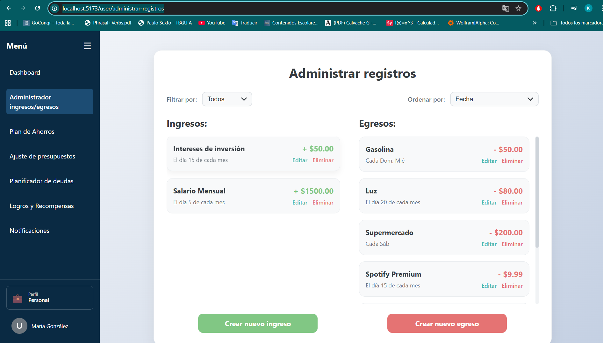
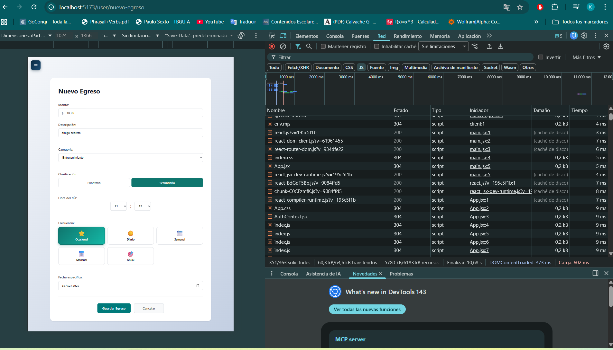
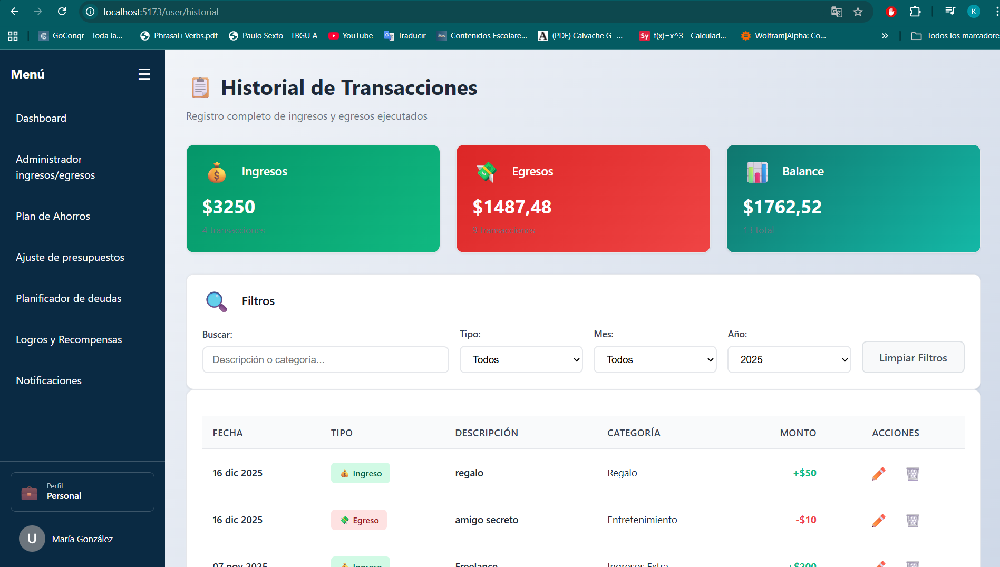
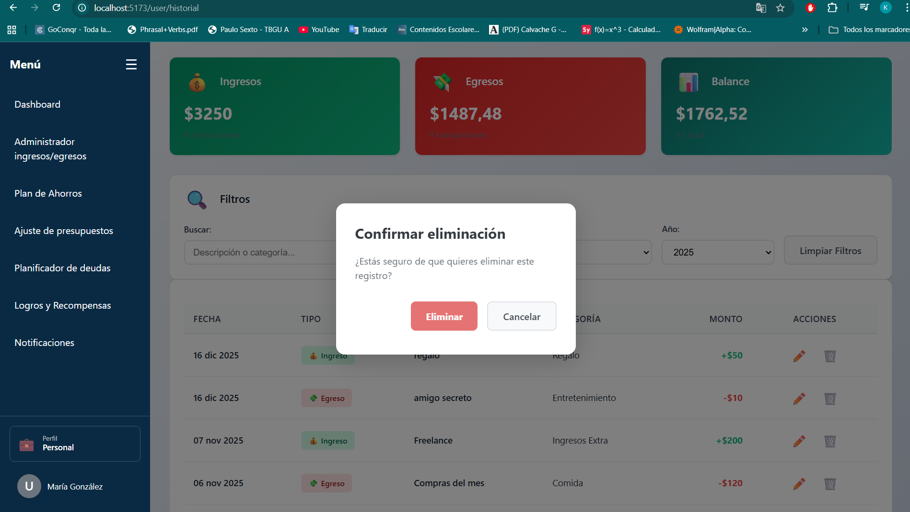
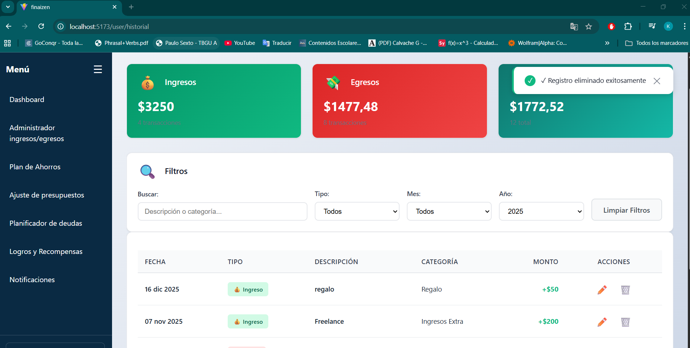

## ESCUELA POLITÉCNICA NACIONAL - FACULTAD DE INGENIERÍA ELÉCTRICA Y ELECTRÓNICA - APLICACIONES WEB Y MÓVILES

# Informe 07
# Finaizen - Frontend Web + Backend

## Descripción breve del objetivo de la práctica

- **Nombre de la aplicación:** Finaizen

El objetivo de la práctica fue implementar un backend funcional con Node.js, que incluya endpoints básicos (GET, POST, DELETE) para la comunicación bidireccional entre frontend y servidor, validando una solicitud, respuesta y la actualización de UI.

## Implementación del Backend

En el archivo package.json se encuentran todas las dependencias necesarias para realización de la práctica.
Y los Endpoints implementados son los siguientes:

- GET /items - Cargar datos
- POST /items - Crear/enviar datos
- DELETE /items/:id - Eliminar datos
Los cuales se encuentran integrados en la aplicación para:
La gestión de deudas, La gestión de egresos e ingresos, el sistema de notificaciones (SmartNotifications) y la configuración de API
Por otro lado, la configuración del servidor se encuentra en el archivo apiConfig.js y la base de datos se utiliza un sistema mock en el archivo mockDatabase.js. El cuál, simula las respuestas del servidor para desarrollo y pruebas.

ya mismo cambio esto
## Capturas de las funcionalidades implementadas

### 1. Verificación de una petición GET

*Página Administrar Resgistros*
En la página se puede observar que al dar click a la pestaña Administrar Ingresos/Egresos, se carga información sobre otros ingresos y egresos, confirmando la respuesta de una petición GET.

### 2. Verificación de una petición POST

*Form para crear un nuevo egreso llamado "amigo secreto"*

*Mensaje de notificación del registro de un nuevo egreso*

*Verificación en el dashborad de la actualización de la lista de registros en Transacciones Recientes*

### 3. Verificación de una petición DELETE

*Verificación en el historial de transacciones de que se realizó la creación de un nuevo egreso llamado "amigo secreto"*

*Mensaje para confirmar la eliminación del egreso llamado "amigo secreto"*

*Se verifica la eliminación del egreso llamado "amigo secreto" y la actualización de la lista en el historial de transacciones*

## Conclusiones y recomendaciones

### Conclusiones
- Se implementó la comunicación bidireccional entre React y un backend simulado mediante mockDatabase.js, permitiendo que el frontend consuma datos dinámicamente y que las operaciones se reflejen inmediatamente en la interfaz.
- Se validaron las operaciones requeridas como el GET para cargar deudas/gastos, POST para crear registros, DELETE para eliminar items. Lo que demuestra que en el orden de una solicitud, el procesamiento, la respuesta y la actualización de UI funciona correctamente.
- Se mantiene la coherencia entre la UI (componentes React responsive), lógica de negocio (modelos de datos estructurados) y comunicación (configuración centralizada en apiConfig.js), permitiendo que cambios en el backend se realicen automáticamente.
- La arquitectura modular permite que todas las vistas sean responsive, lo que no compromete la funcionalidad backend, y permitirá escalar añadiendo nuevos endpoints y componentes sin afectar los existentes.

### Recomendaciones
- El implementar un servidor Express separado con base de datos real en lugar del mock actual, permitirá persistencia de datos y prepara la aplicación para producción con endpoints documentados y seguros.
- El agregar validación tanto en frontend como en backend sería necesario para evitar datos inválidos y más importante aún el manejo de excepciones en todos los endpoints del CRUD.
- Se debería realizar la protección en los endpoints para que cada usuario solo acceda a su información financiera, implementando autenticación y roles de usuario (admin, usuario regular, premium).
- Para evitar múltiples peticiones, se recomienda agregar indicadores visuales mientras se espera la respuesta del servidor, mejorando la experiencia del usuario y evitando que presione botones múltiples veces.
